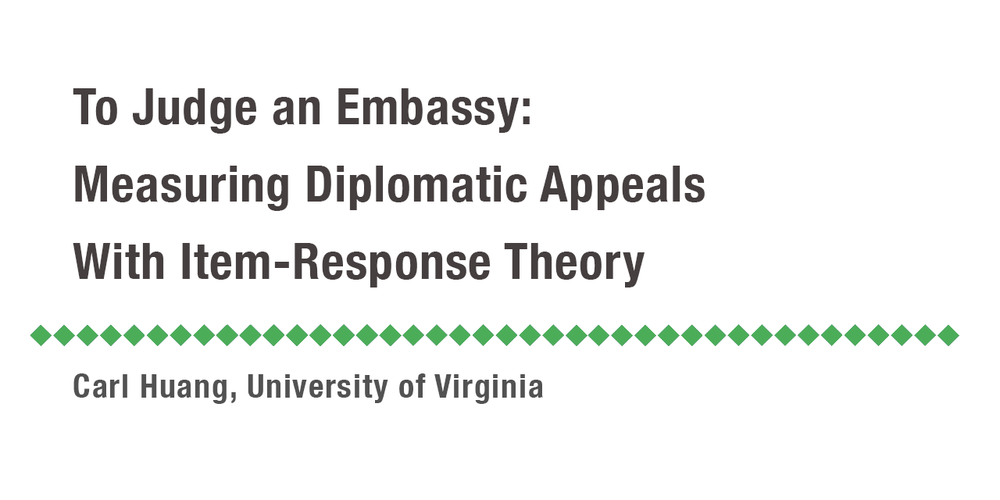

## Project Available in Bookdown Format!
* Please check https://carlpch.github.io/Estimating-Soft-power/_book/ for more information.

## Summary
* I implemented an IRT model on global embassy data to build a "soft power" index that measures countries’ diplomatic appeal.
* The model is capable of detecting countries that "punch above their weights" (few ties but high diplo- matic appeals) and countries that engage in irregular activities (offering diplo- matic recognitions for economic benefits).
* This project was supported by University of Virginia.
